# Obentou (おべんとう)

## General Information

Obentou is a multi system emulator with the goal to collect all the emulators I developed in these years.

## Download

Releases can be found [here](https://github.com/yughias/Obentou/releases/)

## Supported Core

At the moment the supported cores are:

- [X] Bytepusher (Fantasy 1 Opcode machine)
- [X] GBC (dmg/gbc/mega duck)
- [X] NES
- [X] PCE (PC-Engine)
- [X] PV1000 (Casio PV-1000)
- [X] TMS80 (TMS918 + Z80 systems) (sms/gg/sg1000/sc3000)
- [X] WATARA (Watara Super Vision)

## Features

- [X] Custom bindings for Keyboard/Gamepad
- [X] Turbo mode
- [X] Rewind
- [X] SaveStates
- [X] LoadState on open ROM
- [X] Loading from .zip

## Screenshots

| 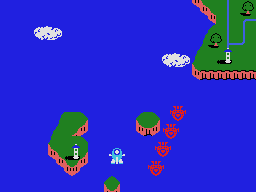 | 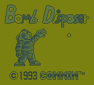 | 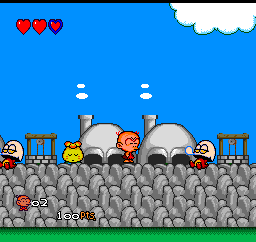 | 
| -------------------------------------------- | -----------------------------| ----------------------- |
| 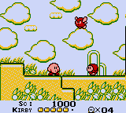 |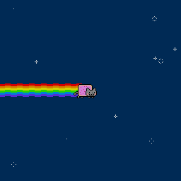 | 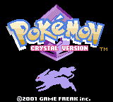 |
| 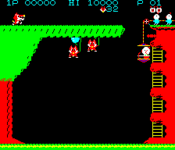 | 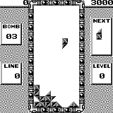 | 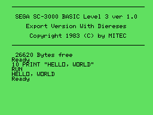 | 
| 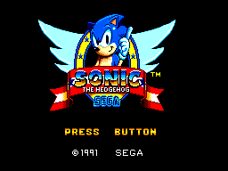 |  | 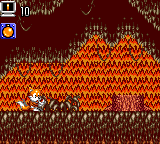 | 

## Cores that will be supported on the future

- [ ] ZX-Spectrum 48k
- [ ] CHIP-8
- [ ] Space Invaders Arcade
- [ ] Pac-Man / Ms. Pac-Man Arcade
- [ ] Gameboy Advance

## Next features

- [ ] Disable illegal input combinations
- [ ] Multiple controllers support
- [ ] Netplay