# Obentou (おべんとう)

## General Information

Obentou is a multi system emulator with the goal to collect all the emulators I developed in these years.

## Releases

The emscripten port of Obentou can be found [here](https://yughias.github.io/Obentou).

Releases can be found [here](https://github.com/yughias/Obentou/releases/).

## Supported Core

At the moment the supported cores are:

- [X] Bytepusher (Fantasy 1 Opcode machine)
- [X] GBC (dmg/gbc/mega duck)
- [X] NES
- [X] PCE (PC-Engine)
- [X] PV1000 (Casio PV-1000)
- [X] TMS80 (TMS9918 + Z80 systems) 
    - [X] Sega 8 Bit (sms/gg/sg1000/sc3000)
    - [X] Coleco Vision (bios required)
- [X] WATARA (Watara Super Vision)
- [X] CHIP-8
- [X] PACMAN (pacman, ms. pacman, jr. pacman and other pacman based arcade boards)
- [X] Space Invaders Arcade

## Features

- [X] Custom bindings for Keyboard/Gamepad
- [X] Turbo mode
- [X] Rewind
- [X] SaveStates
- [X] LoadState on open ROM
- [X] Loading from .zip

## Screenshots

| 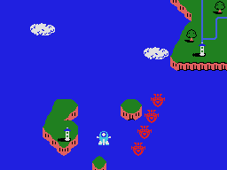 | 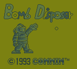 | 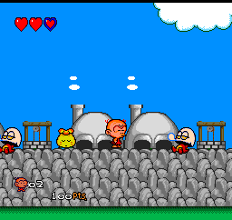       |
|:--------------------:|:----------------------:|:-----------------------:|
| SG-1000              | Mega Duck              | PC Engine               |
| 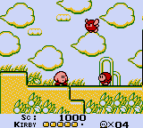    | 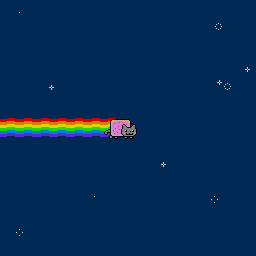       | 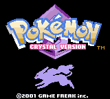       |
| Game Boy             | Byte Pusher            | Game Boy Color          |
| 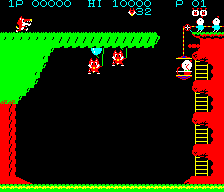 | 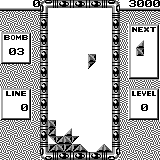   | 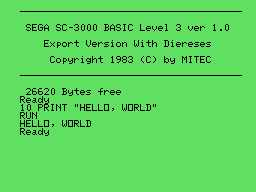    |
| PV-1000              | Watara Super Vision    | SC-3000                 |
| 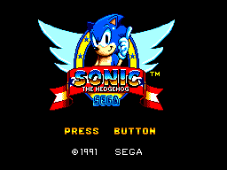    | 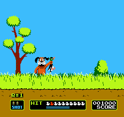      | 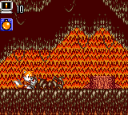        |
| Master System        | Famicom                | Game Gear               |
|     | 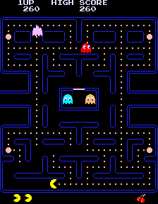   | 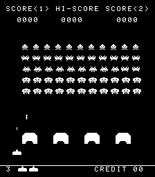  |
| Chip 8               |  Pac-Man (Arcade)      | Space Invaders (Arcade) |
| 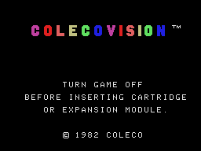    |                        |                         |
| Coleco Vision        |                        |                         | 

## Build Instructions

### Prerequisites

- Windows OS
- MinGW-w64 installed
- A Bash-like shell (e.g., Git Bash)

### Build Steps

1. Clone the repository.
2. Run the following commands:
    ```bash
    mingw32-make
    ```

After a successful build, an executable named ``obentou.exe`` will be generated.


## Cores that will be supported on the future

- [ ] ZX-Spectrum 48k
- [ ] Gameboy Advance

## Next features

- [ ] Netplay
- [ ] Correct Timing on PCE
